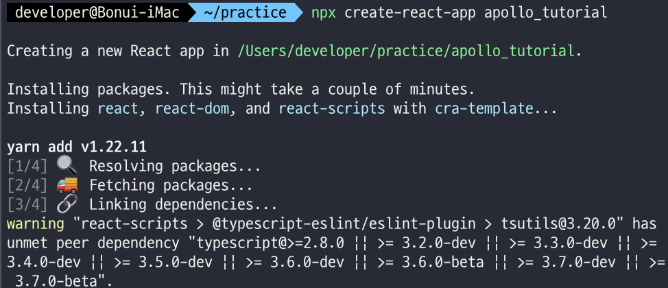
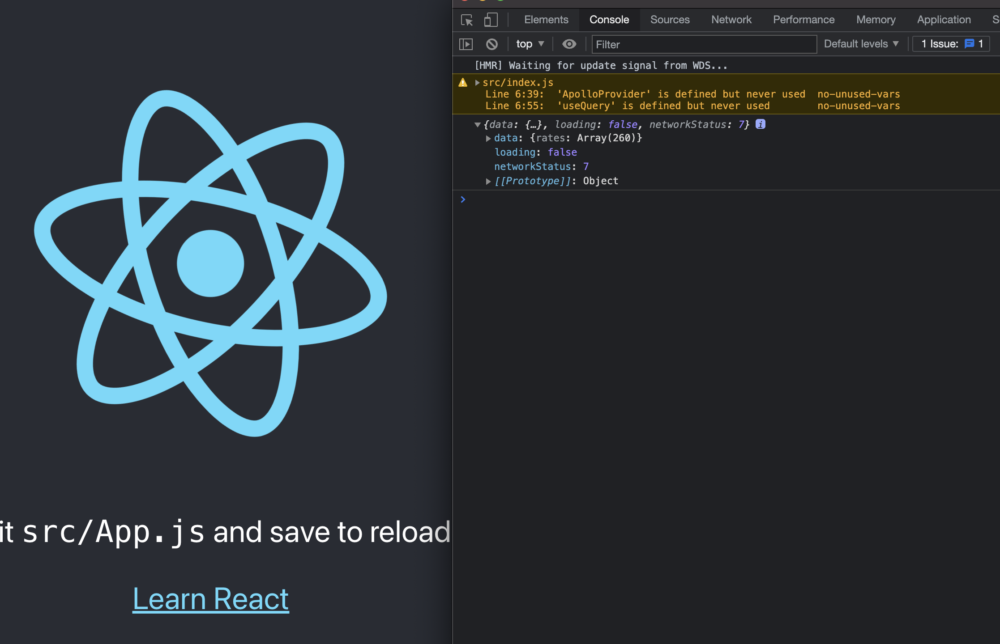

[Apollo Docs](https://www.apollographql.com/docs/react/get-started/)를 번역 및 의역한 내용입니다.

# 리액트에 Apollo Client 적용하기

이 짧은 튜토리얼에서는 Apollo Client를 React에 적용해볼꺼에요

더 상세한 설명은 Apollo의 새로운 러닝 플랫폼인 Odyssey를 확인하세요. 풀스택 튜토리얼을 완벽하게 제공합니다

## [1.](https://www.apollographql.com/docs/react/get-started/#1-setup) 셋업

이번 프로젝트를 진행하기 위하여 리액트 앱을 생성해야하는데, 다음의 두가지 중 하나를 권장합니다.

-   Create React App으로 새로운 프로젝트를 로컬에 만들
-   새로운 프로젝트를 [CodeSandbox](https://codesandbox.io/)를 통해 만들기

저희는 Create React App으로 React App을 하나 만들겠습니다.

```bash
npx create-react-app tutorial
cd tutorial
npm start
```



이제 npm으로 필요한 패키지를 설치합니다.

```bash
npm install @apollo/client graphql
```

-   `@apollo/client`: 이 패키지는 실질적으로 Apollo Client를 구성하는 데 필요한 모든걸 가지고 있습니다. In-Memory 캐시, 로컬 상태 관리 툴, 에러 핸들링, 리액트 기반 View Layer를 제공합니다.
-   `graphql`: GraphQL 쿼리를 파싱하는 로직을 제공하는 패키지입니다.

> 이 튜토리얼에서는 React앱을 CodeSandbox에서 돌릴겁니다. GQL로 작성된 CoinBase API서버에서 환율 데이터를 받아옵니다. 이 리액트 샘플 코드를 [CodeSandbox 링크](https://codesandbox.io/s/get-started-coinbase-client-73r10)에서 확인하실 수 있습니다.

## [2. Apollo Client 초기](https://www.apollographql.com/docs/react/get-started/#2-initialize-apolloclient)설정

Apollo Client를 초기 설정하기 위해선 필요한 것들을 import해와야 합니다. `index.js`에서 `@apollo/client`로부터 필요한 것들을 import하세요

```jsx
//index.js
import { ApolloClient, InMemoryCache, ApolloProvider, useQuery, gql } from '@apollo/client';
```

이제 ApolloClient 인스턴스를 초기화합니다. Apollo Client 인스턴스를 new 예약어로 생성하고 그 안에 uri와 cache를 넣어주세요

```jsx
//index.js
const client = new ApolloClient({
    uri: 'https://48p1r2roz4.sse.codesandbox.io',
    cache: new InMemoryCache(),
});
```

-   `uri` 는 graphql 서버 uri를 말합니다.
-   `cache` 는 InMemoryCache의 인스턴스입니다. Apollo Client가 데이터를 당겨오면 이 캐시에 일단 저장이 되고, 같은 데이터를 당겨오면 이 캐시에서 빠르게 가져옵니다.

이게 끝입니다. 우리가 생성한 client 인스턴스는 이제 gql 데이터를 가져올 수 있습니다. 본격적으로 React 프로젝트를 시작하기 전에 먼저 간단한 JavaScript로 데이터를 불러와봅시다.

작업하던 index.js에 client.query()안에 gql 템플릿에 맞춰 호출 파라미터를 넘깁니다.

```jsx
// const client = ...

client
    .query({
        query: gql`
            query GetRates {
                rates(currency: "USD") {
                    currency
                }
            }
        `,
    })
    .then((result) => console.log(result));
```

이 코드를 실행시키고 콘솔을 열어 결과를 확인해보세요. `data` 오브젝트가 `rates`, `loading`, `networkStatus`.. 등등의 필드와 붙어서 나올껍니다.

```bash
npm start
```

실행 후 React App이 브라우저를 통해 켜지면 `cmd+shift+j`를 눌러 콘솔창을 열어 데이터를 확인합니다.



이렇게 Apollo Client로 GraphQL를 손쉽게 실행하는게 유용해보이지만 Apollo Client의 진면목은 React와 같은 View Layer와 결합되었을 때 빛을 발합니다. Query와 UI를 결합해서 새로운 데이터가 들어오거나 업데이트되었을 때 즉각 바뀌는 UI를 경험해보세요. 어떻게 동작하는지 아래에서 확인해보겠습니다.

## [3. 리액트 앱과 방금 만든 client](https://www.apollographql.com/docs/react/get-started/#3-connect-your-client-to-react) 인스턴스 연결하기

React앱과 Apollo Client는 `ApolloProvider`컴포넌트로 연결됩니다. React의 `Context.Provider`와 비슷하죠? `ApolloProvider`는 리액트 앱을 `Context`로 감싸는 역할을 합니다. 그래서 전역에서 client객체에 접근할 수 있는거에요.(root DOM 트리를 감싸는 컨텍스트이기 때문에 전역에서 Apollo Client를 사용할 수 있습니다)

`index.js`에서 React 앱을 `ApolloProvider`로 감싸주세요. gql을 사용하는 최상단 루트를 감싸라고 권고하지만 웬만하면 App.ts나 Router에서 감싸주시는게 좋습니다. (거의 전역에서 사용하도록)

```jsx
import React from 'react';
import { render } from 'react-dom';
import { ApolloClient, InMemoryCache, ApolloProvider, useQuery, gql } from '@apollo/client';

const client = new ApolloClient({
    uri: 'https://48p1r2roz4.sse.codesandbox.io',
    cache: new InMemoryCache(),
});

function App() {
    return (
        <div>
            {' '}
            <h2>My first Apollo app 🚀</h2>{' '}
        </div>
    );
}

render(
    <ApolloProvider client={client}>
        {' '}
        <App />{' '}
    </ApolloProvider>,
    document.getElementById('root'),
);
```

## [4. `useQuery`](https://www.apollographql.com/docs/react/get-started/#4-fetch-data-with-usequery)로 데이터 가져오기

ApolloProvider가 잘 연결되었다면 이제 `useQuery`로 데이터를 가져오는 테스트가 가능합니다. useQuery는 GraphQL 데이터를 UI에 전달하는 역할을 하는 리액트 훅입니다.

index.js에서 테스트를 계속 이어나갑시다. 첫번째 쿼리를 gql 템플릿 리터럴로 감싸진 쿼리를 하나 정의합니다.

```tsx
// index.js
const EXCHANGE_RATES = gql`
    query GetExchangeRates {
        rates(currency: "USD") {
            currency
            rate
        }
    }
`;
```

다음은  `ExchangeRates` 라는 컴포넌트를 정의할껀데 useQuery로 호출한 `GetExchangeRates` 라는 쿼리를 실행하는 컴포넌트에요.

```tsx
//index.js
function ExchangeRates() {
    const { loading, error, data } = useQuery(EXCHANGE_RATES);
    if (loading) return <p>Loading...</p>;
    if (error) return <p>Error :(</p>;

    return data.rates.map(({ currency, rate }) => (
        <div key={currency}>
            <p>
                {currency}: {rate}
            </p>
        </div>
    ));
}
```

이 컴포넌트가 렌더링되는 시점에서 useQuery 훅은 자동으로 쿼리를 실행한 다음 리턴되는 결과값에서 `loading`, `error`, `data` 등의 데이터를 뽑아냅니다.

-   이는 Apollo Client가 쿼리의 에러나 로딩상태를 개발자를 대신하여 추적해주고 있는 것이고 실제로 loading이나 error 필드를 확인해보면 알 있습니다.
-   쿼리의 결과는 `data`필드에서 확인할 수 있습니다.

마지막에는 `ExchangeRates` 컴포넌트가 렌더링되며 컴포넌트 트리에 하나의 노드로 추가되는 것을 확인할 수 있습니다.

```tsx
//index.js
function App() {
    return (
        <div>
            <h2>My first Apollo app 🚀</h2>
            <ExchangeRates />
        </div>
    );
}
```

데이터가 리로딩되면 데이터 리스트가 도착하기 전에 렌더링되어있는 로딩 인디케이터를 확인하셔야 합니다. 만약 잘 안나오면 [이 링크](https://codesandbox.io/s/get-started-coinbase-client-73r10)를 확인하시고 뭐가 다른지 보고 고쳐보세요

축하합니다 🚀 이번 튜토리얼을 통해 Apollo Client로 GraphQL 데이터를 가져와서 컴포넌트를 렌더링 해보셨습니다. 이제 useQuery를 가지고 더많은 컴포넌트를 이번에 배운 개념을 적용하여 만들어보세요

## [다음 과정](https://www.apollographql.com/docs/react/get-started/#next-steps)

Apollo Client로 어떻게 GQL데이터를 가져오는지 배웠습니다. 더 복잡한 쿼리와 뮤테이션을 만들어보기 위해 다음의 Docs를 읽어볼 것을 권장합니다.

-   [Queries](https://www.apollographql.com/docs/react/data/queries/): 다양한 옵션을 활용해서 GQL 데이터를 쿼리하는 방법에 대해 배웁니다. `useQuery`의 상세한 옵션은 useQuery API를 확인해보세요
-   [Mutations](https://www.apollographql.com/docs/react/data/mutations/): 다양한 옵션을 활용해서 데이터를 생성, 삭제, 수정하는 방법을 배웁니다. 상세한 옵션에 대해서는 `useMutation`의 API문서를 확인하세요
-   [Apollo Client API](https://www.apollographql.com/docs/react/api/core/ApolloClient/): 위에서 JavaScript 코드로 client 객체를 직접 호출했던 예시처럼(client.query()), 때때로 client 인스턴스에 직접 접근해야할 때가 있습니다. 이 떄 필요한 옵션들은 Apollo Client의 API문서에서 확인할 수 있습니다.
