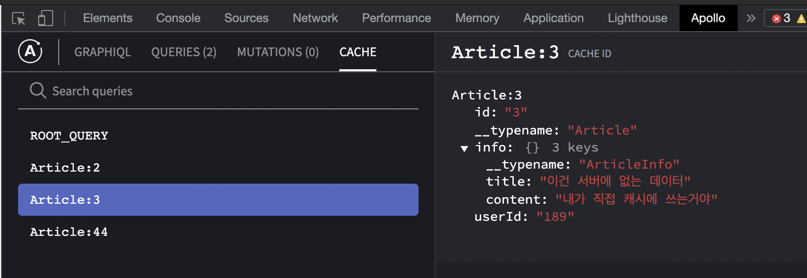
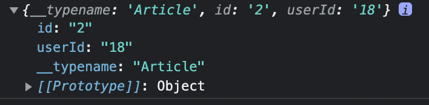
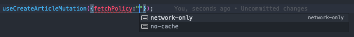
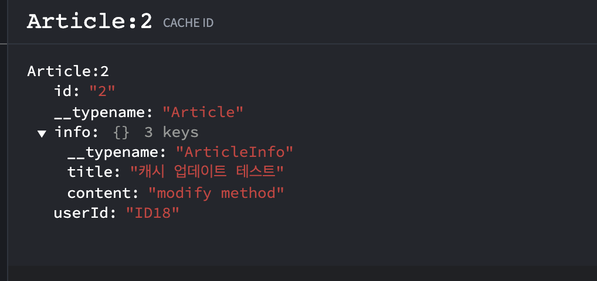
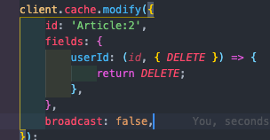
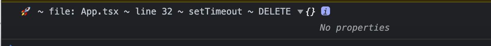
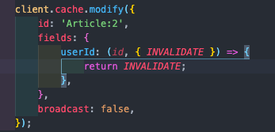
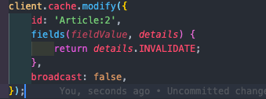
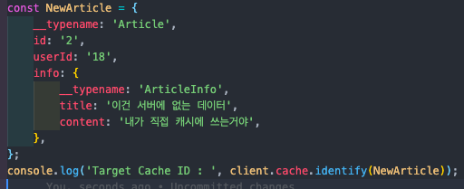
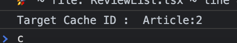

# Apollo Cache에 데이터 읽고 쓰기

---

[Apollo Docs](https://www.apollographql.com/docs/react/caching/cache-interaction/)를 번역 및 의역한 내용입니다.

---

Apollo Client가 매 요청마다 Graphql Server에 다녀오지 않고도 데이터를 fetch할 수 있는 이유가 Cache때문이라고 말했는데, Cache에도 허점이 있습니다. 무결하지 않다는 점입니다. 서버의 데이터는 항상 옳지만 Cache의 데이터는 항상 옳다고는 누구도 보장해주지 않기 때문입니다.

하물며 자동으로 업데이트해주는 cache도 무결하지 않은데, 개발자가 직접 cache를 읽고 쓰는 과정을 여러번 반복한 cache는 얼마나 dirty한 상태일까요. 그래서 cache를 읽고 쓰는 행위는 Server에서 정의된 type과 client에서 정의한 document를 기반으로 명확하게 진행되어야 합니다. 그 과정을 이 문서에서 다루겠습니다.

아래는 Apollo에서 제공하는 Caching method의 종류입니다. 총 5가지입니다.

| STRATEGY                            | API                          | DESCRIPTION                                                             |
| ----------------------------------- | ---------------------------- | ----------------------------------------------------------------------- |
| GraphQL 쿼리를 사용할 때            | readQuery / writeQuery       | 기본적으로 사용하는 GraphQL document만을 활용한 쿼리를 다룰 때 씁니다.  |
| Fragment를 사용할 때                | readFragment / writeFragment | 캐시 전체가 아닌 일부 데이터(ex. Fragment) 객체를 수정할 때 사용합니다. |
| GQL이고 뭐고 그냥 cache를 수정할 때 | cache.modify                 | GraphQL 없이 cache를 조작할 때 사용합니다(위험함👿 )                    |

위의 5가지 캐싱 전략 중 상황에 맞게, 오류가 나지않게 잘 사용하시면 됩니다.

---

## 기본 GraphQL를 사용하는 경우

### readQuery

readQuery 메소드는 cache에서 쿼리를 읽어옵니다. 첫 예시는 기본기를 위해 Apollo Docs를 참고하고, 나머지는 전부 저희 프로젝트를 활용하겠습니다.

```tsx
//gql document 생성
const READ_TODO = gql`
    query ReadTodo($id: ID!) {
        todo(id: $id) {
            id
            text
            completed
        }
    }
`;

// cached data 중 id가 5인 객체를 불러오는 메소드
const { todo } = client.readQuery({
    query: READ_TODO,
    variables: {
        id: 5,
    },
});
```

코드를 보시면, READ_TODO라는 graphql document가 선언되어 있고, Apollo Client 인스턴스인 client는 내장 메소드인 readQuery를 실행시킵니다. 실행할 때 option으로는 query와 variables를 받는데, query는 위에 선언한 gql document고 variables는 쿼리를 실행할 때 담아 보내는 변수를 넣으면 됩니다.

주의할 점은, 캐시에 데이터가 있어야 읽어올 수 있다는 점입니다. 다음과 같은 경우엔 null을 리턴합니다.

1. 다른 document를 넣었다. (ex → query : READ_TODOO)
2. 다른 variables를 넣었다 (ex → variablse : { id : 7 })
3. 쿼리는 잘 날렸는데 fetch-policy를 no-cache로 두고 날렸다

위와 같은 상황이 아니라면 정상 실행된 것이고 다음과 같은 결과를 볼 수 있습니다.

```tsx
{
  todo: {
    __typename: 'Todo', // __typename is automatically included
    id: 5,
    text: 'Buy oranges 🍊',
    completed: true
  }
}
```

cache를 읽는데 성공했습니다 😃

여기서 또 주의할 점은, cache에서 읽어온 이 데이터를 직접 수정하면 안된다는 점입니다. 뒤에 나올 writeQuery 메소드를 사용해서 접근해야지, 일반 assign 연산자로 고치려하면 안됩니다. writeQuery나 WriteFragment는 타입에 안맞게 고치면 에러를 뱉는데 그렇지 않고 막 고친 다음 만약에 다른 곳에서cache가 데이터를 읽어오려는데 하나의 필드라도 없다면 나머지 데이터는 거들떠도 안보고 null을 리턴하니 주의하세요. (Apollo 3.0부터는 안그럴꺼임)

---

### writeQuery

writeQuery는 cache에 데이터를 쓰는 용도로 사용합니다. cache에 쓰여질 data가 추가된다는 점 말고는readQuery와 생김새가 똑같습니다. 저희 클라이언트에서 한번 테스트해보겠습니다. 아래 코드는 App.tsx에서 readQuery로 Articles 데이터를 읽어오고, 새로운 데이터를 Articles의 맨 앞에 붙힙니다.

\*setTimeout을 넣어준 이유는 rendering된 후 즉각 cache가 set되지 않기 때문입니다.

```tsx
//App.tsx
useEffect(() => {
    setTimeout(() => {
        // 1. 특정 document로 읽어왔던 데이터를 캐시에서 다시 읽어옵니다.
        const prevData = client.readQuery({
            query: GetArticlesDocument,
            variables: {
                boardType: Board_Type.Lfg,
            },
        });
        // 2. 개발자가 임의로 새 데이터를 만듭니다.
        const NewArticle = {
            __typename: 'Article',
            id: '3',
            userId: '189',
            info: {
                __typename: 'ArticleInfo',
                title: '이건 서버에 없는 데이터',
                content: '내가 직접 캐시에 쓰는거야',
            },
        };
        // 3. 만든 데이터를 그대로 맨 앞에 붙혀준 다음 cache에 writing합니다.
        client.writeQuery({
            query: GetArticlesDocument,
            variables: {
                boardType: Board_Type.Lfg,
            },
            data: {
                Articles: [NewArticle, ...prevData?.Articles],
            },
        });
    }, 1000);
}, []);
```

이러면 아래 사진처럼, Mutation 콜은 0인데 새로운 데이터 하나가 cache에 생겼습니다. 이건 서버에 없는 데이터입니다. 즉, writeQuery같은 cache에 쓰기 함수를 잘못 사용하면 서버와 클라이언트 간 데이터 무결성이 깨져버리니 사용 시 꼭 주의해야합니다.




없는 데이터로 렌더링한 결과

reload되는 순간 캐시데이터는 없어집니다. 만약 서버에 똑같은 동작을 하는 mutation이 정상적으로 작동했다면 결과는 그대로겠지만, 아니라면 사용자는 어리둥절할겁니다.

이번엔 이미 존재하던 cache데이터를 수정해보도록 하겠습니다.

```tsx
const NewArticle = {
    __typename: 'Article',
    id: '2',
    userId: '18',
    info: {
        __typename: 'ArticleInfo',
        title: '이건 서버에 없는 데이터',
        content: '내가 직접 캐시에 쓰는거야',
    },
};
client.writeQuery({
    query: GetArticleDocument,
    variables: {
        boardType: Board_Type.Lfg,
        id: '2',
    },
    data: {
        Article: NewArticle,
    },
});
```

아래 사진과 같이 왼쪽 데이터는 이미 서버에 있는 데이터라 query하자마자 cache에도 이미 존재하는 데이터입니다. 이 상황에서 똑같은 id의 데이터를 바꾸니 title, content가 바뀐 모습입니다. 새로 생기거나 삭제되지 않고, 똑같인 CacheId를 가진 객체가 수정 되었습니다.


----->


---

## 부분 데이터를 활용하는 경우

### readFragment

readFragemnt 메소드는 cache된 데이터의 부분을 읽어옵니다. 이 때, fragment로 묶인 데이터를 가져올 수 있습니다. (fragment가 없다면 그 자리에서 묶으면 됩니다)

위에서 설명한 readQuery와 다른점은 cacheId를 넣어줘야 한다는 것입니다. (대신 variables가 필요 없음)

```tsx
// graphql/generated/generated.ts
const ArticleIdsFragmentDoc = gql`
    fragment ArticleIds on Article {
		  id
		  userId
		}
// App.tsx
const info = client.readFragment({
		id: 'Article:2',
		fragment: ArticleIdsFragmentDoc,
});
```

위 코드는 Fragment Document와 id를 넘겨서 데이터를 읽는 과정입니다. 아래 사진에서 id, userId 필드만 읽어오는데요, 특정 CacheId의 데이터 안에서 변수로 받은 fragment에 정의된 필드만을 읽어온다는 뜻입니다.




위 코드에서 info를 출력해본 결과

주의할 점은, Id가 2번인 Article이 캐시에 없다던가, 그 Article은 찾았는데 안에 id나 userId 필드가 없다던가 하면, readFragment의 리턴값 자체가 null입니다. (Apollo 3.0 업뎃버젼에선 안그럴꺼임!)

### writeFragment

cache에 쓸 data 필드가 추가되었다는 점을 빼곤 readFragment와 모양이 똑같습니다. 위에 writeQuery에서 설명한 모든 내용이 여기서도 적용됩니다. 사용법만 알아보겠습니다.

```tsx
client.writeFragment({
    id: 'Article:2',
    fragment: ArticleIdsFragmentDoc,
    data: {
        userId: '2500',
    },
});
```

정말 간단합니다. 어떤 CacheId를 가진 객체의 특정 fragment의 필드 중 원하는 필드를 변경합니다. 위에서는 18였던 userId를 2500으로 바꾸었습니다. 나머지 데이터는 똑같은 것을 볼 수 있습니다.


------>


---

## Read/Write로 mutation 결과 update하기

mutation은 query와 다르게 cache를 사용하지 않습니다. 애초에 FetchPolicy부터 network-only와 no-cache밖에 선택할 수 없죠. 그래서 Cache가 생겨도 Root Query 아래로 들어오지 않습니다. 개발자가 직접 Root Query 아래로 넣어줘야합니다. (그래야 생성되는 즉시 렌더링됩니다)



Fetch Policy에 대한 자세한 설명은 [이 링크](https://www.notion.so/Apollo-GraphQL-Fetch-Policy-99c398cc3e7e421298401d9b41e761a7)를 참조해주세요

아래 코드는 그 동작을 구현한 것입니다. 생성과 동시에 update함수에서 현재 cache를 읽고, 생성된 데이터랑 합쳐서 cache에 쓰는 것입니다. fragment가 포함된 데이터라면 메소드만 read/writeFragment로 바꿔서 쓰시면 됩니다.

```tsx
createArticle({
    variables: {
        boardType: Board_Type.Lfg,
        Article: {
            title: '타이틀 테스트',
            content: '컨텐츠 테스트',
        },
    },
    update: (_, { data }) => {
        try {
            const prevData = client.readQuery({
                query: GetArticlesDocument,
                variables: {
                    boardType: Board_Type.Lfg,
                },
            });
            client.writeQuery({
                query: GetArticlesDocument,
                variables: {
                    boardType: Board_Type.Lfg,
                },
                data: {
                    Articles: [...prevData.Articles, data?.createArticle],
                },
                broadcast: true,
            });
        } catch (error) {
            console.log(error);
        }
    },
});
```

## 캐시 직접 조작하기

### modify

modify 메소드는 캐시를 그냥 변수처럼 변경할 수 있게 해줍니다. Docs에선 directly modify cache라는 표현을 사용합니다. 직접 접근해서 삭제나 수정같은 작업을 수행할 수 있다는 뜻입니다. 기능이 자유로운 만큼 매우 위험한 메소드라고 생각하시면 됩니다. modify 메소드는 다음과 같은 특징들을 가집니다.

1. writeQuery/Fragment와 같이, 변경되면 모든 active query들에게 broadcast됩니다. (broadcast 옵션을 false로 해두면 무시됩니다)
2. writeQuery/Fragment와는 다르게, 존재하지 않는 cache데이터에는 쓸 수 없습니다. (modify에는 생성기능이 없습니다!)
3. merge function(다음 글에서 다룰 예정)으로 incomming 데이터를 어떻게 merge할꺼냐를 정하는 merge policy를 만들 수 있는데, modify 메소드는 이 merge function을 무시합니다. (정확히 말하면 override 해버림)
4. cache 조작 후 fetchPolicy를 조작할 수 있습니다. useQuery의 baseOptions 중 nextFetchPolicy를 설정해주면 됩니다(당연히 cache-first가 좋겠죠?)

modify 메소드의 사용법은 다음과 같습니다.

1. 옵션으로 id(cacheId)와 fields를 넘깁니다(필수)
2. 캐시 수정하는 콜백함수를 작성합니다. (필드 하나당 함수 하나씩 작성해줘야함) 이전 cache를 받아서 변경할 데이터를 리턴하는 함수입니다. 이 함수를 안넣어주면 원래 값 그대로 리턴합니다.
3. broadcast나 optimistic같은 선택옵션을 추가해줍니다.

예제를 보겠습니다. modify 메소드를 호출할 때 필요한 인자를 넣어줍니다. cacheId는 Article:2로 넣어줬고, 바꾸고 싶은 field들을 나열합니다. 각각 어떻게 바꾸고 싶은지 정의하는 콜백함수를 넘겨주고, 리턴되는 값대로 바뀝니다.

-   userId는 원래 값을 id로 받아와서 앞에 ID라는 string을 붙혀 리턴해줬습니다.
-   info는 원래값을 info로 받아와서 새로 생성한 fragement로 변경해줬습니다.

```tsx
// App.tsx
client.cache.modify({
    id: 'Article:2',
    fields: {
        userId: (id, _) => {
            return 'ID' + id;
        },
        info: (info, _) => {
            const newInfo = {
                __typename: 'ArticleInfo',
                title: '캐시 업데이트 테스트',
                content: 'modify method',
            };
            return newInfo;
        },
    },
    broadcast: false,
});
```

다음과 같이 변경되었습니다.



Docs의 예시 중 하나를 보겠습니다. 저희도 나중에 Article에 Comment가 붙으면 이런방식을 사용해야 할겁니다. 원래 writeFragment 메소드는 Fragment가 속한 상위 객체의 CacheId를 넘겨야 했는데, modify를 사용한다면 id를 안넘겨도 됩니다.

mutation의 특성 상 addComment 이 호출되는 순간 cache에 update된다. 하지만 이 Posts Query가 이걸 추적하고 있진 않아서, 직접 cache update를 업데이트 해줘야한다. 그래서 아래 newCommentRef는 추가생성 없이 이미 생성되어있던 캐시데이터를 그대로 리턴해줍니다.

```tsx
const [addComment] = useMutation(ADD_COMMENT, {
    update(cache, { data: { addComment } }) {
        cache.modify({
            id: cache.identify(myPost),
            fields: {
                comments(existingCommentRefs = [], _) {
                    //이건 이미 cache에 존재하는 데이터임
                    const newCommentRef = cache.writeFragment({
                        data: addComment,
                        fragment: gql`
                            fragment NewComment on Comment {
                                id
                                text
                            }
                        `,
                    });
                    //mutate 함수의 결과값을 붙혀서 리턴
                    return [...existingCommentRefs, newCommentRef];
                },
            },
        });
    },
});
```

modify 메소드를 사용할 때 주의해야 할 점은, 콜백함수의 인자입니다. 콜백함수가 가져오는 값이 일반 Scalar값이면 그냥 그 값을 넘겨주고 마는데(ex, userId) 만약 그 값이 다른 CacheID로 관리되는 또 다른 cached object라면 이걸 직접 변경하면 안됩니다. writeQuery나 writeFragment를 써야합니다. 이걸 바꾸는 순간 전역에서 이 object를 쓰는 UI에도 broadcasting되니 변경 전에 생각 많이 해보셔야합니다.

### Modify utility functions

위의 예시에서 target field와 함께 넘겨받는 두번째 인자(위에선 \_ 처리함)가 있었습니다. 여기엔 modify 시 유용하게 사용할 수 있는 utility function들이 들어있습니다. 하나씩 살펴보겠습니다.

```tsx
// 아래 의 utilityFunctions에 들어있는 것들을 하나씩 까보도록 하자
cache.modify({
	id: "Article:2"
	fileds:
			filedName: (targetField, utilityFunctions) => {
			   return `userId = ${id}`;
			},
})

```

1. readField

readField는 말그대로 특정 객체에서 특정 field를 읽어오는 메소드입니다. 특정 필드이름과 읽으려는 객체를 넘겨주면 됩니다.

아래 예시에서는 게시글 데이터에서 'abc123'이라는 id를 가진 Comment를 하나 삭제하려고 합니다.

```tsx
const idToRemove = 'abc123';

cache.modify({
    id: cache.identify(myPost),
    fields: {
        comments(existingCommentRefs, { readField }) {
            return existingCommentRefs.filter((commentRef) => idToRemove !== readField('id', commentRef));
        },
    },
});
```

comments라는 필드가 원래 가지고 있던 데이터는 existingCommentRefs인데, 이 중에 내가 지우고 싶은 코멘트의 id가 실제로 있는지 확인하고 지우는 과정입니다.

다음과 같이 활용도 가능합니다. 새로운 Comment를 추가할 때, 캐시에 해당 코멘트가 있는지 확인하고, 존재하는 데이터면 원래 데이터를 리턴, 없으면 새로운 Comment 생성 로직을 수행할 수 있습니다.

```tsx
if (existingCommentRefs.some((ref) => readField('id', ref) === newComment.id)) {
    return existingCommentRefs;
}
//... create New Comment in Cache
```

1. DELETE

특정 Cache ID에서 특정 field를 삭제할 때 사용합니다. 사용법은 DELETE 객체를 받아서 리턴해주면 됩니다. 저 DELETE 객체는 아래 사진과 같이 빈 객체입니다.

<!-- Horizontal Container 적용해야함 -->






1. INVALIDATE

\*INVALIDATE의 효과가 정확하게는 뭔지 잘 모르겠는데, 추후에 알게되면 추가하겠습니다.

일반적으로 특정 field를 수정하거나 삭제하게되면 그 field는 무효화됩니다. 이미 해당 cache 데이터의 그 field 이용하고 있던 쿼리들 입장에서는 다시 읽어와야겠지요.

이와 같은 동작을 cache.modify를 사용하게되면 삭제하거나 수정하지 않아도 가능합니다. INVALIDATE 값을 리턴해주면 됩니다. 아래와 같이 사용하면 되고 데이터는 그대로인데 해당 field는 무효화됩니다.



특정 field만 무효화하고 싶을 때



모든 field들을 무효화하고 싶을 때

1. CacheID 가져오기

    cache.identify는 CacheID를 리턴하는 메소드입니다. CacheID를 커스터마이징 하거나 Deps가 높아 \_\_typename을 추적하기가 힘들 때 속편하게 이 메소드를 쓰면 cacheID를 리턴해줍니다.

    아래와 같이 Cache엔 없지만 임의로 Cache Data처럼 생긴 NewArticle을 만들어서 identify 메소드에 넣어보겠습니다.

    

    실제 cache에 없는 데이터도 CacheID 계산이 잘 되는것을 볼 수 있습니다.

    

---

## Outtro

특히 mutation을 사용할 때, cache를 직접 조작할 일이 많을겁니다. 잘 사용하면 사용자 경험을 극대화할 수 있으면서 성능도 잡을 수 있지만, 잘못 사용하면 데이터가 통째로 날아가버리거나 이상한 데이터가 렌더링되는 오류가 생길 수 있습니다. 그래서 cache만큼은 정확하게 알고 사용하셔야합니다.

---
