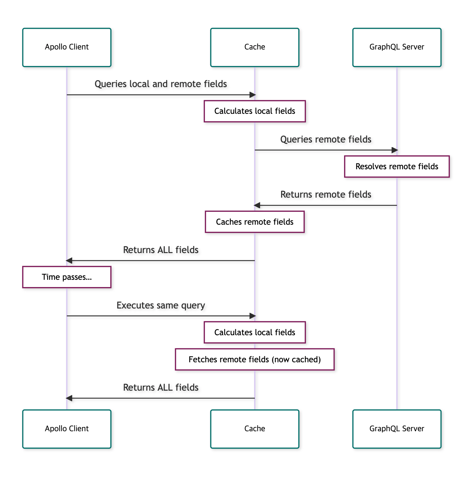

# Apollo Client에서 Local State 관리하기

---

### [Apollo Docs](https://www.apollographql.com/docs/react/local-state/local-state-management/)를 번역 및 의역한 내용입니다.

---

아폴로 클라이언트는 태생적으로 서버와 GraphQL로 쿼리하기 위해 개발된 상태 관리 라이브러리입니다. 그래서 당연하게도 모든 데이터가 로컬에서 관리되는 앱은 아폴로를 쓸 필요가 없죠. 그런데 아폴로 클라이언트는 로컬 상태 또한, 서버에서 가져온 데이터와 함께 관리할 수 있습니다.

## 사용방법

로컬 스토리지든 아폴로 캐시든 어디에 저장하든 상관없는데, 저장하고 나서는 아폴로 클라이언트가 어떻게 그 데이터를 가져오고 업데이트할지에 대한 로직을 정해야합니다. 로컬데이터와 서버 데이터를 섞어서 가지고오거나 덮어쓸 수 있습니다.

위의 데이터 흐름을 구현하기 위해 아폴로 클라이언트 3에서부터 field policy와 reactive variable이라는 필수 매커니즘을 도입했습니다.
:::caution
버전 2에서 제공되던 로컬 리졸버 API는 더이상 사용할 수 없습니다.
:::

## Field Policy와 Local-Only field

> 아폴로 클라이언트 3.0 이상부터 사용 가능합니다.

**필드 정책**은 서버 스키마에 정의되지 않은 필드를 포함하여 쿼리의 특정 필드를 커스터마이징합니다. 이 중에서 로컬용 필드를 정의하면 localStorage나 reactive Variables에 있는 데이터를 활용할 수 있습니다.

하나의 쿼리 안에는 로컬 전용 필드와 서버에 정의된 필드를 동시에 불러올 수 있습니다. 이 중 read함수나 merge함수같이 이를 조작할 수 있는 함수를 선언해서 커스터마이징 하면 됩니다.

## [Reactive variables](https://www.apollographql.com/docs/react/local-state/local-state-management/#reactive-variables)

> 아폴로 클라이언트 3.0 이상부터 사용 가능합니다.

Reactive Variable은 GraphQL 쿼리나 뮤테이션 없이 전역에서 로컬데이터를 읽고 쓸 수 있게 해주는 개념입니다. 다만 field policy를 정의해야 합니다.

Reactive Variable은 아폴로 캐시에 저장되는게 아닙니다. 그래서 캐시 구조에 적용되는 딱딱한 룰들을 따를 필요가 없고 그냥 원하는대로 저장하고 가져다 쓰면 됩니다.

Reactive Variable이 변하면 아폴로 클라이언트는 이를 감지하고 해당 필드를 포함하는 쿼리들을 자동으로 업데이트해줍니다.
