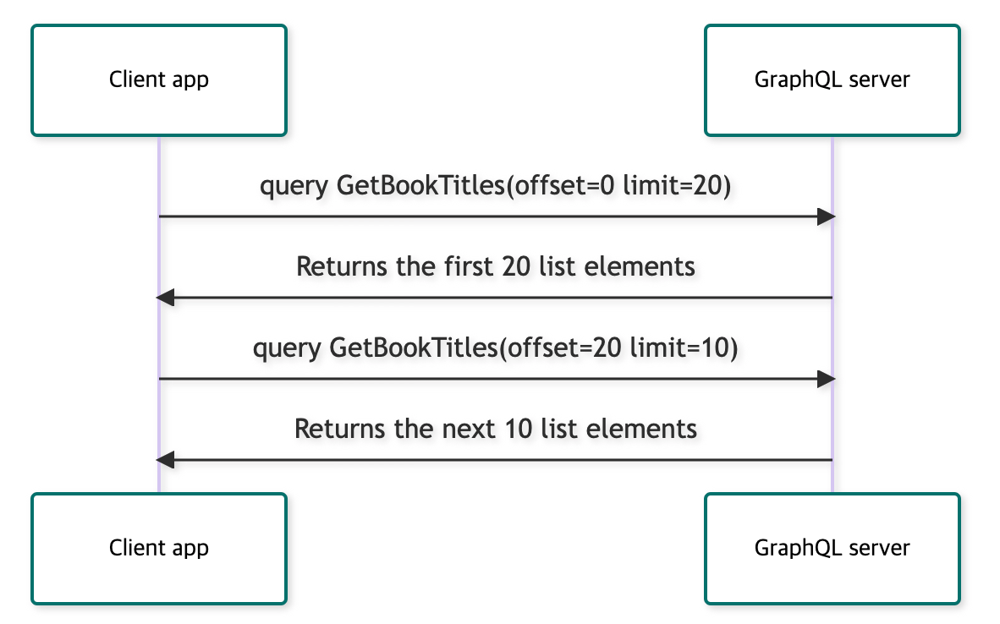

# 페이지네이션 살펴보기

이 글은 [Apollo Client 공식문서](https://www.apollographql.com/docs/react/pagination/overview/)를 해석 및 개인적인 의견을 추가한 것입니다.

GrqphQL은 그래프(grqph 이론의 Node와 Edge로 이루어진 그래프입니다)처럼 쓸데없는 일(Overhead) 없이 정확하게 원하는 데이터만을 가져올 수 있도록 해줍니다. 그 결과 네트워크 응답속도를 빠르게 합니다.

그러나 GrqphQL을 사용한다고 다 그런 효율적이로 빠른 응답속도를 보장해주진 않습니다. 이는 특히 List(Array)를 쿼리해올 때 그렇습니다. List는 다음과 같이 작아보이는 쿼리로도 오버헤드가 커질 수 있습니다. 몇 개가 있을지 모르기 때문이죠.'

```graphql
query GetBookTitles {
  books {
    title
  }
}
```

저 Book이 왕립도서관 데이터베이스라고 가정해봅시다. 책 뿐만 아니라 작은 문서와 수백종류나 되는 몇 십년 치 신문자료도 모두 저장했다고 하면, 저 쿼리 하나로 수백만개의 데이터가 날아올겁니다. 필요 이상으로 오는것이죠. 이 문제를 해결하기 위해 GrqphQL 서버는 이 List fields를 **페이지네이션**합니다.

클라이언트가 이 리스트를 페이지네이션 할 때, 서버는 일정한 부분만큼만 리턴해줍니다(1페이지 분량) 클라이언트의 쿼리는 몇 페이지를 리턴해야할 지 쿼리를 보낼 때 알려줘야합니다.



Apollo Client 공식문서에서 설명한 자료입니다.

위의 플로우 차트는 **offset-based pagination**을 보여줍니다. 맨 위를 보시면 쿼리를 보낼 때 offset과 limit 두 값을 같이 보내는데, 이 때 offset이라는건 리스트에서 페이지를 뜻하고 limit은 한 페이지에 최대 몇 개의 element를 포함시킬지를 정하는 것입니다.

이 밖에도 서버는 다양한 페이지네이션 전략을 가지고 있습니다. offset-based, cursor-based, page-number-based, forwards, backwards, 등등 많습니다. 각각의 전략들은 offset이나 limit같은 매개변수를 각각 조금씩 다른걸 받는데요. 다 각기 다른 상황에 적합하게 쓰이기 때문입니다.

# Apollo Client의 접근

The Apollo Client Aproach

각각의 페이지네이션 전략을 추천드리기보다, Apollo Clinet는 어떤 페이지네이션을 사용하든 페이지네이션된 데이터를 합칠 수 있도록 능동적으로 골라쓰실 수 있는 cache 관련 API를 제공합니다. 그리고 이런 커스텀 페이지네이션 함수들을 선언해두고 재사용하실수도 있습니다.
